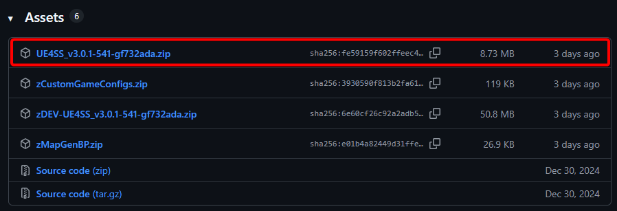
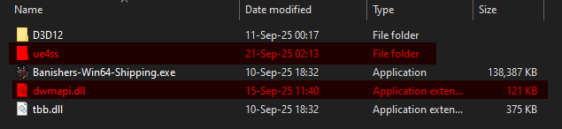
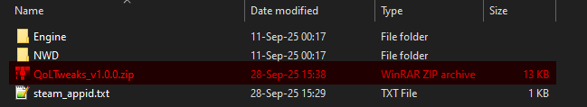
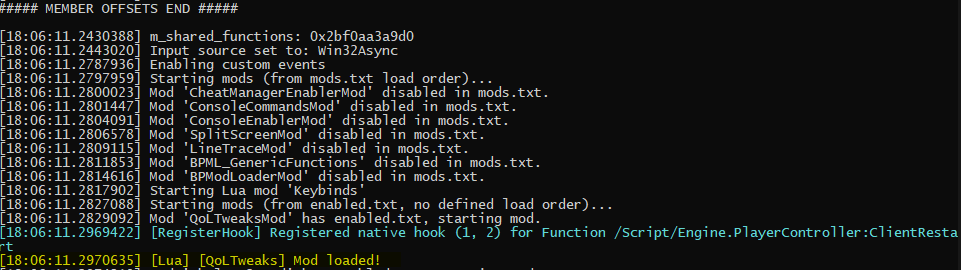

# QoL Tweaks
A [UE4SS](https://github.com/UE4SS-RE/RE-UE4SS) and pak-based mod for Banishers: Ghosts of New Eden.

Features several minor quality of life tweaks, including rebalanced rituals, no screen shake while sprinting and allowing the player to change their FOV.

# Features
- Rebalanced Rituals
    - By default, Rituals reduce all damage not related to the chosen mechanic (for example `Manifestations deal more damage`) by 75%
    - This damage penalty is removed, allowing the player to deal full damage with all actions.
    - If you'd like to undo this change and assuming you're playing the Steam version, go to
    `..\steamapps\common\Banishers Ghosts of New Eden\NWD\Content\Paks\Mods` and remove the three `RitualsRebalanced_P` files.

- No camera shake while sprinting
    - Removes the wobbling from the camera while sprinting.
    - If you'd like to undo this change and assuming you're playing the Steam version, go to
    `..\steamapps\common\Banishers Ghosts of New Eden\NWD\Content\Paks\Mods` and remove the three `NoCameraShakeSprint_P` files.

- Custom FOV
    - Will automatically set the FOV to a custom value set by the player.
    - To change the default value (90) or disable this, edit: 
    `..\steamapps\common\Banishers Ghosts of New Eden\NWD\Binaries\Win64\ue4ss\Mods\QoLTweaksMod\Scripts\config.lua`

# Installation
> If you already have UE4SS installed, skip to step 3

1. First, head over to [UE4SS's releases page on GitHub](https://github.com/UE4SS-RE/RE-UE4SS/releases) and scroll down to the "Assets" dropdown.

    Click on it and grab the archive for `experimental-latest` - as of the time of writing (28th of Sep. 2025), that would be `UE4SS_v3.0.1-541-gf732ada.zip`.

    

2. Place the archive you just downloaded _next_ to the game's executable.

    Assuming you're using Steam, the location would be:  
    `..\steamapps\common\Banishers Ghosts of New Eden\NWD\Binaries\Win64`

    Unpack the archive with a program of your choice.  
    This is what the above directory should now look like:  
    

3. Next, open up the [releases page for this mod](https://github.com/Faith001/QoLTweaks/releases) click on the "Assets" dropdown again and download the latest version - as of the time of writing that would be `QoLTweaks_v1.0.0.zip`

    Download this archive and place it at the root of the game directory.  
    Once again assuming you're using Steam the path would be:  
    `..\steamapps\common\Banishers Ghosts of New Eden`  
    

    Unpack the archive with a program of your choice.  
    When asked to overwrite some files, click `Yes to all`.

    > The mod overwrites the default `mods.txt` and `UE4SS-settings.ini` so you don't have to edit them by hand.

    Do note the order of operations, UE4SS needs to be unpacked _first_ and this mod second.

4. Finally, launch the game.

    If everything went well you should see a Windows Console pop up with the following text:  
      

5. That's it, enjoy!
